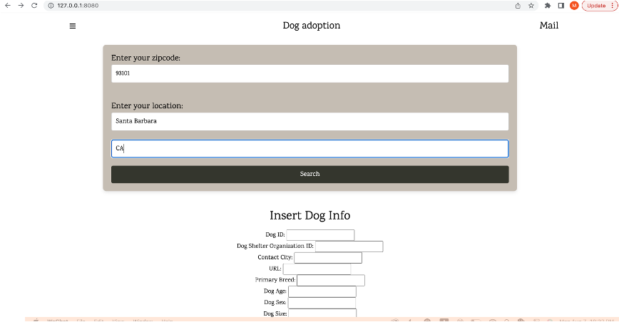
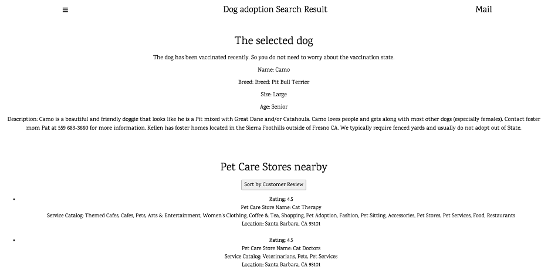
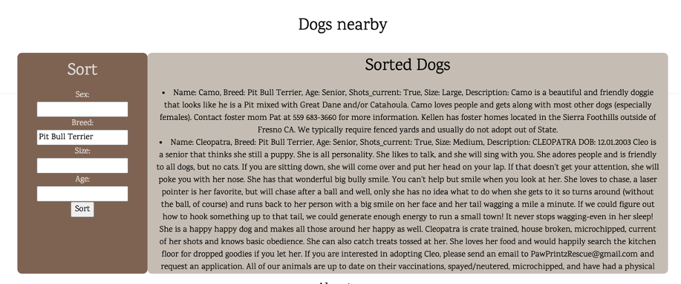
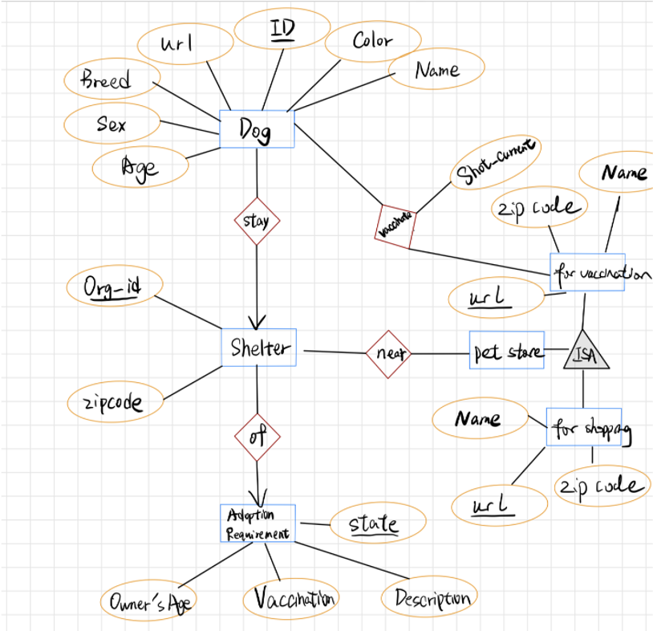

# Dog-adoption-website
Project is written by Marissa Zhang, Yining Wang, Osama Kheshaifaty 

## Project Description
Our project is a website where provides thousands of adoptable dogs, shelters, and even recommended dog service information.
As the database has a huge amount of information contained, and users would like to sort those information with different key words or conditions. A database is important to help efficiently access and organize a sorted output. Users can find a dog they want to adopt by sex, breed or just one that lives near them. The application would also automatically recommend clinics for vaccination if the dog is currently not vaccinated. Adoption requirement of each state is also provided. Shelter owners can store new dog information.

## Datasets source
<table>
    <thead>
        <tr>
        <th width="500px">Data</th>
        <th width="500px">Source</th>
        </tr>
    </thead>
    <tbody>
    <tr width="600px">
        <td>
            Dog, Shelter
            
</td>   
        <td>
          The dog and shelter dataset is from Koggle. Contains over 20,000 records  
        </td>
        </tr>
<tr><td>Clinics, Pet-care services</td>
    <td>From yelp dataset</td></tr>
</tr>
<tr><td>Dog adoption State requirement</td>
    <td>Crawl from the state government websites</td></tr>
</tr>
</tbody>
</table>

## Application Demo
### Home Page

The home page contains a search bar and insert place. The user can enter the zip code, city, and state information, and we can recommend the shelters and dogs nearby. Also, the user can use the form below to insert data (dog ID, Contact City, URL.....) into the database like queries 7,8,9. So the database can keep updated.

### Search Result Page

The search result page shows the zip code, city, and state the user entered before and the dog's result. The dog nearby result shows the dogs’ information by using the sqllite like query 1, and the result can be sorted by sex, breed, size, age like query 2. Each dog is clickable.

### Filter Dog Page

When searching the dog, all the dogs can be sorted by sex, breed, age and size. By these information combined with zipcode information, the website can recommend the user to find her/his/their own favourite dog.

## Application Detail
### ER Diagram

### Relational Model
* **Dogs (ID, url, Name, Age, Sex, primary_breed, Color, Org-ID,shot_current,description,contact_city)** 
Primary key: Dog-ID Secondary Key: url 
Foreign Key: Shelter-ID 
* **Shelters (org_id, state, city)**  
Primary key: Shelter-ID
* **Adoption Requirements (State, requirement, age)**  Primary Key: State  
Secondary key: URL
* **Pet_care (for shopping pet accessories) (business_id, Name,postal_code, categories,state,stars)** 
Primary Key: business_id 
Secondary Key: (Name, postal_code)
* **clinics (for vaccination) (business_id, Name,postal_code, categories,state, stars)**   
Primary Key: business_id 
Secondary Key: (Name, postal_code)
